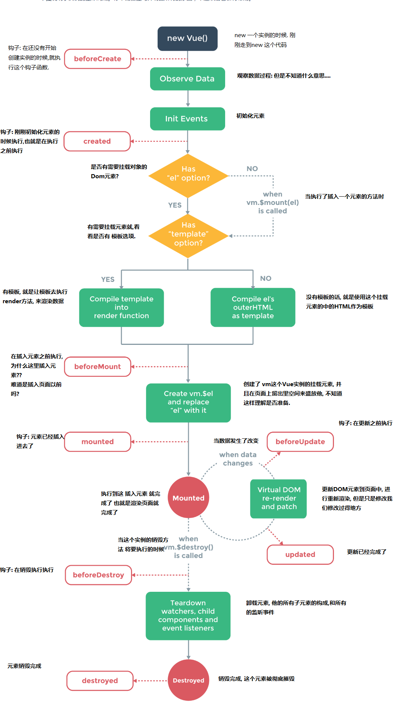

## 问题:
* 为什么说所有的组件都是被扩展的vue实例?
* 扩展的使用方法不用能明确?
* 箭头函数绑定的是父上下文什么意思呢?
* 配置实例中的数据观测是什么呢?
* 在实例中插入元素和插入模板的国政理解的有点混乱?
* 在Vue中如何使用JSX语法.
* 依旧不能理解表达式与语句的区别.

## 总结:
* 所有的组件都是被扩展的vue实例
* 只有在创建实例时代理的属性才是响应的,后面添加的并不算
* `v-bind`添加多个属性的话, 需要写多个v-bind
* 使用`v-`指令后面的属性必须使用`""`进行获取整个实例内的属性, 如果要添加字符串就使用`''`


# Vue 实例
## 构造器
* 每个Vue.js应用都是通过构造函数`Vue`创建一个**Vue的根实例**
```js
var vm = new Vue({
    //选项
})
```
* Vue并没有完全遵循MVVM模式, Vue的设计模式但是收到了MVVM开发模式的影响
* 在实例化Vue时, 需要传入一个**选项对象**,包含数据,模板,挂载元素,方法,声明周期钩子,等子元素
* 可以扩展`Vue`构造器,从而预定义选项创建时可以复用的**组件构造器**
```js

var MyComponet = Vue.extend({
    //扩展器
})

//所有的 MyComponet 实例都将以预定义的扩展选项被创建
var myComponetInstance = new My Component()
```
* **所有的vue.js组件其实都是被扩展的Vue实例**
* **
## 属性和方法
* 每个`Vue`都会**代理**其`data`对象里的所有的属性.
```js
var data = {
    a: 1
}
var vm = new Vue({
    data: data
})
vm.a = data.a //true

//设置属性值,会影响到原来的值
vm.a = 2
data.a // -> 2

//修改原来的值,也会影响到vue的属性值
data.a = 3
vm.a // -> 3
```
* 注意只有这被代理的属性是**响应的**, 如果实例创建之后添加的新的属性到实例上, 那么不会触发视图的更新.
* 除了data属性, Vue暴露了一些有用的实例属性和方法,这些属性和方法都有前缀`$`,以便与代理的data属性区分开.
```js
var data = {
    a: 1
}
var vm = new Vue({
    el: "#example",
    data: data
})
vm.$data === data // -> ture
vm.$el = document.getElementById('example') // -> true

// $watch是一个实例方法
vm.$watch('a', function(newVal, oldVal){
    //这个方法在 vm.a 的值改变的时候执行
    console.log("a的值改变了")
    console.log(newVal) // 改变后的值
    console.log(oldVal) // 改变前的值
})
```
> 注意不要在实例属性或者毁掉函数中(如: `vm.$watch('a',newVal => this.method())`) 使用**箭头函数**. 箭头函数绑定父上下文, 所以`this`不会像预想的那样是是Vue实例,而是`this.method` 未被定义
* **
## 实例声明周期
* 每个Vue实例在被创建之前都要经过一系列的初始化过程.
* 例如: 实例需要配置数据观测(data.observer), 编译模板, 挂载实例到Dom, 然后在数据变化时更新Dom, 在这初始化的过程中, 实例也会调用一些**生命周期钩子**, 这就给我们提供了执行自定义逻辑的机会.例如: `created`这个钩子就是在实例被创建之后调用的.
```js
var vm = new Vue({
    data: {
        a: 1
    },
    created: function(){
        // this 指向 vm 实例
        console.log("a is: " + this.a)
    }
})
// -> "a is 1"
```
* 也要一些其他的钩子在,是实例不同的生命周期进行创建: 如: `mounted`, 'updated', `destroyed`. 钩子的 `this` 指向调用他的实例Vue实例.
* Vue 没有控制器的概念. 组件的自定义逻辑可以分布在这些钩子中.
* **
## 生命周期图示

* **
# 模板语法
* Vue.js使用了基于HTML的模板语法,允许开发者声明式的将DOM绑定至底层Vue实例的数据.所有的Vue.js的模板都是合法的HTML, 所以可以被遵循规范的浏览器和HTML解析器解析.
* 在底层实现上,Vue将模板编译成虚拟DOM渲染函数.结合响应系统,在应用状态改变时,Vue能够智能地计算出重新渲染组件的最小代价并应用到DOM上.
* 也可以使用原始的DOM方法,不借用模板,`直接写渲染(render)函数`, 并且使用JSX语法.
## 插值
### 文本
* 数据绑定采用最常见的形式 使用"Mustache"的语法(双大括号)的文本插值:
```html
<span>Message: {{msg}}</span>
```
* Mustacheb 标签将会替代为对应对象上 `msg` 属性的值. 无论何时,绑定在对象上 `msg` 属性发生了改变, 插值处的内容都会被更新.

* 通过使用 `v-once指令`, 可以进行一次性的插值,当数据改变时,插值处的内容不会更新,但需要注意这会影响到该节点上所有的数据绑定:
```html
<span v-once>This will never change {{msg}}</span>
```
### 纯HTML
* 双大括号, 将会被解析为纯文本, 而非HTML. 为了输出真正的HTML, 需要使用`v-html`来复合局部模板,因为Vue并不是基于字符串的模板引擎.组件更加适合担任 UI 复用与复合的基本单元.
> 在站点上动态渲染的任意HTML可能会非常危险,因为很容易导致`XSS攻击`.对可信任的网站使用HTML插值, 绝对不要让用户进行插值操作.
### 属性
* Mustache不能在HTML中使用,应使用命令 `v-bind指令`:
```html
<div v-bind:id="dynamicId"></div>
```
* 这对布尔值的属性同样有效, 如果条件值改为了false的话, 该属性就会被移除:
```html
<button v-bind:disabled>Button<button>
```
### 使用JavaScript表达式
* Vue提供了完全的JavaScript表达式的支持
```html
{{ number + 1 }}
{{ OK ? 'YES' : 'No' }}
{{ Message.split(' ').reverse().join(' ')}}
<div v-bind:'list-' + id></div>
```
* 这些表达式会在所属的Vue实例的数据作用域下作用域下为javascript被解析.
* **限制:** 每个绑定都只能包含单个表达式,所以以下的例子不会被实现
```html
<!-- 这是语句, 不是表达式 -->
{{var a = 1}}
<!-- 流程控制也不会生效 -->
{{if (ok) {return message}}}
```
> 模板表达式都被放在沙盒中,只能访问一个全局变量的一个白名单, 如`Math`和`Date`. 不可以在模板表达式中试图访问全局用户定义的变量
* **
## 指令
* 指令是带有`v-`前缀的特殊属性.指令的预期目标是单一的javascript表达式,(除了 `v-for`). 指令的责任就是当前表达式的值改变时,相应的将某些行为应用到DOM上.
```html
<p v-if="seen">Now you see me</p>
```
### 参数
* 一些指令只能接受一个"参数", 在指令后面添加冒号指明, 例如: `v-bind`指令就是用来指定HTML元素的属性的.
```html
<a v-bind:href="url"></a>
```
* 另外一个例子就是`v-on`指令,用来监听DOM事件
```html
<a v-on:click="doSomething">
```
* 这里的参数就是监听的事件名.
### 修饰符
* 修饰符是以`.`指明的特殊后缀,用指出一个指令应该以一种特殊的方式进行绑定. 例如: `.prevent`修饰符告诉`v-on`指令用于触发的事件调用`event.preventDefault()`;
```html
<form v-on:submit.prevent="onSumit"></form>
```
## 过滤器
* Vue.js允许自定义过滤器,用作一些常见的文本格式化. 过滤器可以用在两个地方, **mustache插值和`v-bind`表达式**. 过滤器应该添加在javascript表达式的尾部, 由"管道符"指示.
```html
<!-- in mustaches -->
{{ message |　capitalize }}
<!-- in v-bind -->
<div v-bind:id="rawId|formatId"></div>
```
> 在Vue 2.x中,过滤器只能用在 mustache 语法和 `v-bind` 中. 因为过滤器设计的目的就是为了转化. 为了在其他指令中实现更加复杂的数据转化, 应该使用 **计算属性** .
* 过滤器函数总接受表达式的值作为第一个参数
```js
var vm = new Vue({
    // ..
    filters: {
        capitalize: function(value) {
            if (!value) return ''
            value = value.toString()
            return value.charAt(0).toUpperCase() + value.slice(1)
        }
    }
})
```
* 过滤器可以进行串联
```html
{{ message | filterA | filterB }}
```
* 过滤器是JavaScript函数, 可以接受参数
```html
{{ message | filterA('arg1', arg2) }}
```
* 这里, 字符串 `arg1` 将作为第二个参数传入过滤器, 表达式 `arg2`的将被求值, 然后作为第三个参数传入过滤器.
* **
## 缩写
* `v-`前缀在模板中是作为一个标示Vue特殊属性的明显属性.但有时会稍微有点繁琐. 同时当Vue.js管理所有模板的SPA时, v-前缀显得没有那么重要了. 因此, Vue.js为两个作为常用的指令提供了缩写模式
### `v-bind` 缩写 
```html
<!-- 完整写法 -->
<a v-bind:href="url"></a>
<!-- 缩写 -->
<a :href="url"></a>
```
### `v-on` 缩写
```html
<!-- 完整写法 -->
<a v-on:clikc="something"></a>
<!-- 缩写 -->
<a @click="something"></a>
```


