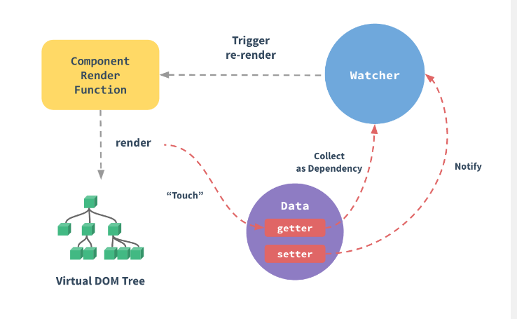

# 深入响应式原理
* 我们已经涵盖了大部分的基础知识. 现在是时候深入底层原理了. Vue最显著的特性之一便是不太引入注意的响应式系统,
* 模型层知识普通JavaScript对象, 修改它则更新视图View. 这会让状态管理变得非诚简单且直观, 不过理解它的工作原理以避免一些常见的问题, 也很重要. 

## 如何追踪变化
* 把一个普通的JavaScript对象传给Vue实例的`data`选项, Vue将遍历此对象所有的属性, 并使用Object.definePropty把这些属性全部转为 getter/setter. Object.defineProperty是仅ES5支持的, 且无法shim的特性, 这也就是为什么Vue不支持IE8或者更低版本浏览器的原因.
* 用户看不到getter/setter, 但是在内部它们让Vue追踪依赖, 在属性被访问和修改通知时变化. 这里需要注意的问题是浏览器控制台在打印数据对象时, setter/getter的格式化并不相同, 所以可能需要安装 vue-devtools来获取更多友好的检查接口
* 每个实例都有对应的 watcher 实例对象, 它会在组件渲染的过程中把记录属性为依赖, 之后当依赖项的`setter`被调用时, 会通知`watcher`重新计算, 从而致使它关联的组件得以更新.
* 

## 变化检测问题
* 受现代化JavaScript的限制,(以及废弃`Object.observe`), Vue**不能检测对象属性的添加或删除**. 由于Vue会在初始化实例时执行`getter/setter`转化过程, 所以属性必须在`data`对象上存在才能让Vue转成它,这样才能让它是响应的. 例如:
```js
var vm = new Vue({
  data: {
    a: 1
  }
})
// vm.a 是响应的

vm.b = 2
// vm.b 是非响应的.
* Vue不允许在已经创建的实例