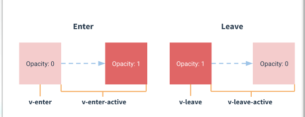

# 过渡效果

## 概述
* Vue在插入, 更新或者移除DOM时, 提供了多种不同方式的应用过渡效果
* 包括以下工具
  * 在CSS过渡和动画中自动应用class
  * 可以配合使用第三方CSS动画库, 如 Animate.css
  * 在过渡钩子函数中使用JavaScript直接操作DOM
  * 可以配合使用第三方JavaScript动画库, 如Velocity.js
* 在这里, 只会讲解进入. 离开和列表的过渡, 其他的可以参考 03管理过渡状态

## 单元素/组件的过渡
* Vue提供了`transiton`的封装组件, 在下列情形中, 可以给任何元素和组件添加entering/leaving过渡
  * 条件渲染 (使用`v-if`)
  * 条件展示 (使用`v-show`)
  * 动态组件
  * 组件根节点
* 这里是一个典型的例子
```html
  <style>
  .fade-enter-active, .fade-leave-active {
    transition: opacity .5s
  }
  .fade-enter, .fade-leave-to {
    opacity: 0  
  }
  </style>

  <div id="demo">
    <button v-on:click="show = !show">
      Toggle
    </button>
    <transition name="fade" mode="">
      <p v-if="show">hello</p>
    </transition>
  </div>

  <script>
  new Vue({
    el: '#demo',
    data: {
      show: true
    }
  })
  </script>
```

* 当插入或删除包含在`transtion`组件中的元素时, Vue将会做如下处理:
  1. 自动嗅探目标元素使用应用了CSS过渡或动画, 如果是, 在恰当的时机添加/删除CSS类名
  2. 如果过渡组件提供了JavaScript钩子函数, 这些钩子函数将在恰当的时机被调用
  3. 如果没有找到JavaScript钩子并且没有检测到CSS过渡/动画, DOM操作(插入/删除)在下一帧中立即执行, (注意: 此指浏览器逐帧动画机制, 和Vue的`nextTick`概念不同)

  ### 过渡的-CSS-类名
  * 会有6个(CSS)类名在enter/leave的过渡中切换
    1. `v-enter`: 定义进入过渡的开始状态. 在元素被插入时生效, 在下一个帧移除.
    2. `v-enter-active`: 定义过渡的状态. 在元素整个过渡过程中作用, 在元素被插入时生效, 在`transition/animation`完成之后移除. 这个类可以用来定义过渡的过程时间, 延迟和曲线函数
    3. `v-enter-to`: 定义进入过渡的结束状态. 在元素被插入一帧后生效(于此同时`v-enter`被删除), 在`transition/animation完成之后移除`.
    4. `v-leave`: 定义离开过渡的开始状态. 在离开过渡被触发时生效, 在下一个帧移除.
    5. `v-leave-active`: 定义过渡的状态. 在元素整个过程中作用, 在离开过渡被触发后立即生效, 在`transition/animation`完成之后移除. 这个类可以用来定义过渡的过程时间, 延迟和曲线函数.
    6. `v-leave-to`: 定义离开过渡的结束状态. 在离开过渡被触发一帧后生效(于此同时`v-leave`被删除), 在`transition/animation`完成之后移除.
* 
* 对于这些在`enter/leave`过渡中切换的类名, `v-`是这些类名的前缀. 使用`<transtion name="my-transition"></transtion>`可以重置前缀, 比如`v-enter`替换为`my-transition-enter`.
* `v-enter-active` 和 `v-leave-active`可以控制进入/离开过渡的不同阶段.

### CSS 过渡
* 常用的过渡都是使用CSS过渡
```css
  .slide-fade-enter-active {
    transition: all .3s ease;
  }
  .slide-fade-leave-active {
    transition: all .8s cubic-bezier(1.0, 0.5, 0.8, 1.0);
  }
  .slide-fade-enter, .slide-fade-leave-to {
    transform: translateX(100px);
    opacity: 0;
  }
```
```html
<div id="example-1">
  <button @click="show = !show">
    Toggle Reander
  </button>
  <transition name="slide-fade" mode="">
    <p v-if="show">hello</p>
  </transition>
</div>
```
```js
  new Vue({
    el: '#example-1',
    data: {
      show: true
    }
  })
```
### CSS 动画
* CSS动画用法同CSS过渡, 区别是在动画中`v-enter`类名在节点插入DOM后不会理解删除, 而是在`animationend`事件触发时删除
```css
  .bounce-enter-active {
    animation: bounce-in .5s;
  }
  .bounce-leave-active {
    animation: bounce-in .5s reverse;
  }
  @keyframes bounce-in {
    0% {
      transform: scale(0);
    }
    50% {
      transform: scale(1.5);
    }
    100% {
      transform: scale(1);
    }
  }
```
```html
<div id="example-2">
  <button @click="show = !show">Toggle show</button>
  <transition name="bounce" mode="">
    <p v-if="show">Loot at me!</p>
  </transition>
</div>
```
```js
  new Vue({
    el: '#example-2',
    data: {
      show: true
    }
  })
```
### 自定义过渡类名
* 我们可以通过以下特征来自定义过渡类名:
  * enter-class
  * enter-active-class
  * enter-to-class
  * leave-class
  * leave-active-class
  * leave-to-class
* 他们的优先级高于普通的类名, 这对于Vue的过渡系统和其他第三方CSS动画库, 如Animate.css结合十分有用.
```html
<link href="https://unpkg.com/animate.css@3.5.1/animate.min.css" rel="stylesheet" type="text/css">
<div id="example-3">
  <button @click="show = !show">
    Toggle render
  </button>
  <transition
    name="custom-classes-transition"
    enter-active-class="animated tada"
    leave-active-class="animated bounceOutRight"
  >
    <p v-if="show">hello</p>
  </transition>
</div>
```
```js
new Vue({
  el: '#example-3',
  data: {
    show: true
  }
})
```
### 同时使用Transtions和Animations
* Vue为了知道过渡的完成, 必须设置相应的事件监听器. 它可以是`transitoned` 或 `animationed`, 这取决于给元素应用的CSS规则. 如果你使用其中任何一种, Vue能自动识别类型并设置监听.

* 但是, 在一些场景中, 你需要给同一个元素同时设置两种过渡动效, 比如`animation`很快的被触发并完成了, 而`transition`效果还没结束. 在这种情况下, 你就需要使用`type`特性并设置`animation`或`transition`来明确声明你需要Vue监听的类型

### JavaScript钩子
* 可以在属性中声明JavaScript钩子
```html
  <transition 
  name="" mode=""
  v-on:before-enter="beforeEnter"
  v-on:enter="enter"
  v-on:after-enter="afterEnter"
  v-on:enter-cancelled="enterCancelled"

  v-on:before-leave="beforeLeave"
  v-on:leave="leave"
  v-on:after-leave="afterLeave"
  v-on:leave-cancelled="leaveCancelled"
  >
    
  </transition>
```
```js
    methods: {
      // 进入中
      beforeEnter: function (el) {
        // ...
      },
      // 此回调函数是可选项的设置
      // 与 CSS 结合时使用
      enter: function (el, done) {
        // ...
        done()
      },
      afterEnter: function (el) {
        // ...
      },
      enterCancelled: function (el) {
        // ...
      },

      // 离开时
      beforeLeave: function (el) {
        // ...
      },
      // 此函数是可选项的设置
      // 与 CSS 结合使用
      leave: function (el, done) {
        // ...
        done()
      },
      afterLeave: function (el) {
        // ...
      },
      // leaveCancelled只能用于 v-show 中
      leaveCancelled: function (el) {
        // ...
      }
    }
```
* 这些钩子函数可以结合CSS `transitions/animations`使用, 也可以单独使用
> 当只有JavaScript过渡的时候, **在`enter`和`leave`中, 回调函数`done`是必须的,** 否则, 他们会被同步调用, 过渡会立即完成.
> 推荐对于仅使用JavaScript过渡的元素和`v-bind:css="false"`, Vue会跳过CSS的检测. 这也可以避免过渡过程中CSS的影响
* 一个使用Velocity.js的简单例子:
```html
  <div id="example-4">
    <button @click="show = !show">
      Toggle
    </button>
    <transition
      v-on:before-enter="beforeEnter"
      v-on:enter="enter"
      v-on:leave="leave"
      v-bind:css="false"
    >
      <p v-if="show">
        Demo
      </p>
    </transition>
  </div>
```
```js
new Vue({
  el: '#example-4',
  data () {
    return {
      show: false
    }
  },
  methods: {
    beforeEnter: function (el) {
      el.style.opacity = 0
      el.style.transformOrigin = 'left'
    },
    enter: function (el, done) {
      Velocity(el, {
        opacity: 1,
        fontSize: '1.4em'
      },{
        durantion: 300
      })
      Velocity(el, {
        fontSize: '1em'
      },{
        complete: done
      })
    },
    leave: function (el, done) {
      Velocity(el, {
        translateX: '15px',
        rotateZ: '50deg'
      },{
        durantion: 600
      })
      Velocity(el, {
        rotateZ: '100deg'
      },{
        loop: 2
      })
      Velocity(el, {
        rotateZ: '45deg',
        translateY: '30px',
        translateY: '30px',
        opacity: 0
      },{
        complete: done
      })
    }
  }
})
```

## 初始化渲染的过渡
* 可以通过 `appear` 特性设置节点的在初始渲染的过渡
